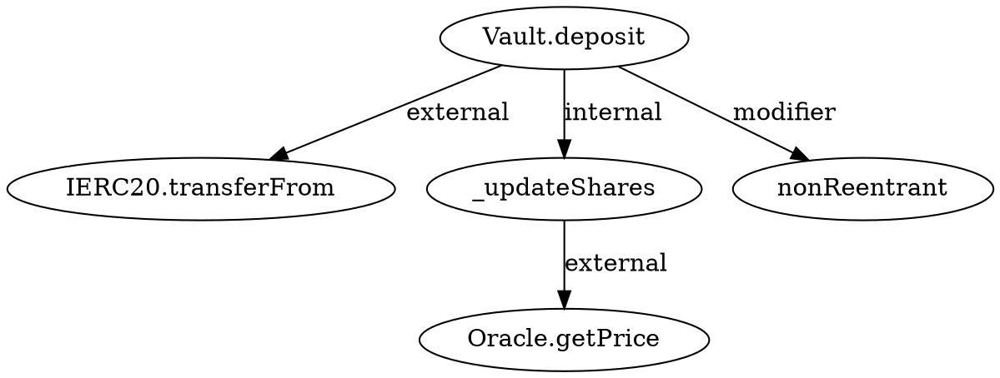
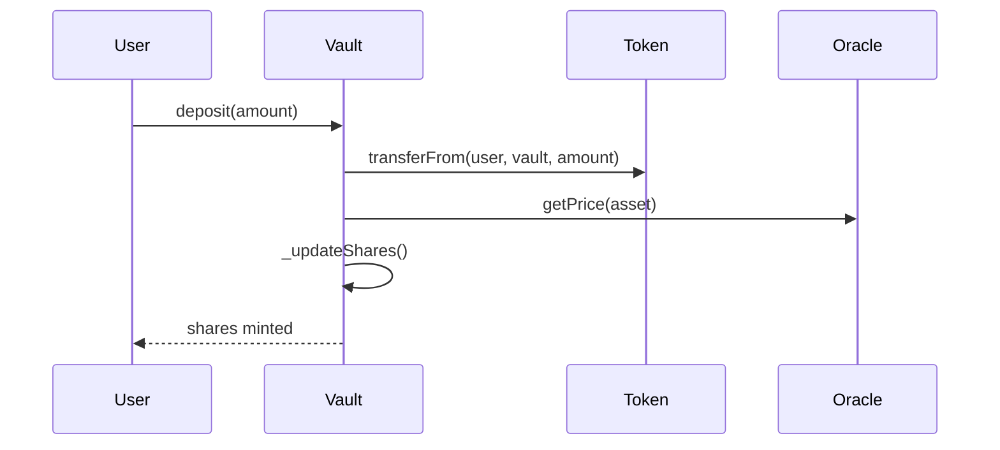

# CLAUDE.md v5.0 — Compositional Exploit Discovery Engine
## For Mature, Battle-Tested Protocols on Ethereum Mainnet (2026)
*(Evidence-only • Protocol-complete • Cross-contract • Feasibility-gated • Traverse-mandatory • Zero-tolerance for trivia)*

---

# ABSOLUTE BANS (Override Everything)

## BANNED PATTERNS — Never Investigate, Never Reason About

These patterns are **completely banned** from all analysis. Any hypothesis involving them is immediately rejected. Do not waste compute on them.

```
BANNED_PATTERN_001: FIRST_DEPOSITOR / EMPTY_VAULT
- Reason: Mitigated in all production contracts via minimum shares, virtual reserves, or dead shares
- Action: Skip immediately. Do not write hypothesis. Do not mention in reasoning.

BANNED_PATTERN_002: UNINITIALIZED_PROXY / IMPLEMENTATION_TAKEOVER
- Reason: OpenZeppelin's _disableInitializers() is standard since 2021. All audited contracts use it.
- Action: Skip immediately. Do not probe initialization functions.

BANNED_PATTERN_003: SIMPLE_REENTRANCY
- Reason: ReentrancyGuard or CEI pattern is universal. Auditors catch these on day one.
- Action: Skip immediately. Only investigate READ-ONLY reentrancy in complex cross-contract scenarios.

BANNED_PATTERN_004: BASIC_ACCESS_CONTROL_MISSING
- Reason: onlyOwner/role-based access is standard. This is not a 2016 contract.
- Action: Skip immediately.

BANNED_PATTERN_005: TIMESTAMP_MANIPULATION
- Reason: PoS blocks are slot-based (12s). Proposers cannot manipulate timestamps.
- Action: Skip immediately. Only investigate slot/epoch boundary effects.

BANNED_PATTERN_006: SIMPLE_OVERFLOW_UNDERFLOW
- Reason: Solidity 0.8+ has checked math. unchecked blocks are rare and intentional.
- Action: Skip immediately unless analyzing unchecked assembly.

BANNED_PATTERN_007: DONATION_ATTACKS_ON_VAULTS
- Reason: Modern vaults use internal accounting, not balanceOf(). ERC4626 has virtual assets.
- Action: Skip immediately.

BANNED_PATTERN_008: SIMPLE_FRONTRUNNING
- Reason: MEV protection (Flashbots, private mempools) is standard. Not novel.
- Action: Skip immediately unless part of a complex multi-step sequence.

BANNED_PATTERN_009: KNOWN_TOKEN_QUIRKS_WITHOUT_CONTEXT
- Reason: Fee-on-transfer, rebasing, pausable tokens are documented. Protocols handle them.
- Action: Only investigate if protocol claims to support these but doesn't.

BANNED_PATTERN_010: ORACLE_MANIPULATION_WITHOUT_COST_MODEL
- Reason: "Oracle can be manipulated" is useless without proving cost < profit.
- Action: Only proceed if you have computed manipulation cost vs. extractable value.
```

**Enforcement**: Before creating any hypothesis, verify it does not match a BANNED_PATTERN. If it does, discard it and move on. Do not log it. Do not discuss it.

---

# GLOBAL RULES

## Rule 1: E3-Only Stop Condition

**NEVER STOP until one of these conditions is met:**
1. **SUCCESS**: A validated, economically feasible exploit exists with:
   - Fork execution proof
   - Net profit > $10,000 USD (after gas, fees, market impact)
   - Minimum attacker tier identified
   - Robustness verified under perturbation
2. **EXTERNAL INTERRUPT**: Emit `resume_pack.md` and continue next session.

## Rule 2: Protocol-Complete Analysis

**Every contract MUST be analyzed in its full protocol context:**
- Map to parent protocol (Uniswap, Aave, Curve, etc.)
- Identify all related contracts (factory, router, oracle, token, governance)
- Understand protocol state machine and phase transitions
- Build cross-contract call graphs
- Map all external dependencies (oracles, bridges, other protocols)

**Single-contract analysis is insufficient.** Exploits in mature protocols emerge from cross-contract interactions, not single-function bugs.

## Rule 3: Evidence-First Progress

- Progress requires **experiments** with **measured deltas**
- Every iteration MUST append to `experiments.jsonl`
- Every experiment MUST include: `convergence_delta`, `net_profit`, `attacker_tier`, `gas_cost`
- Artifact completion without experiments is NOT progress

## Rule 4: Intelligence Routing

Use external intelligence sources for every contract:
- **DeBank API**: Asset holdings, protocol exposure, historical activity
- **Traverse Toolchain**: MANDATORY full analysis (see PART I-A)
- **ItyFuzz**: Intelligent coverage-guided fuzzing when parameter space is large
- **Chain state**: Direct RPC queries for current balances, rates, and oracle prices

## Rule 5: TRAVERSE TOOLCHAIN MANDATORY (NEW in v5.0)

**NO CONTRACT ANALYSIS MAY BEGIN WITHOUT COMPLETE TRAVERSE TOOLCHAIN EXECUTION.**

Before ANY hypothesis generation, ALL FIVE Traverse tools MUST be executed:
1. `sol2bnd` — Binding file generation (FIRST)
2. `sol2cg` — Call graph generation (requires bindings)
3. `sol-storage-analyzer` — Storage pattern analysis
4. `storage-trace` — Cross-function storage comparison
5. `sol2test` — Automated test scaffold generation

**Failure to run all five tools is a BLOCKING condition.**

---

# PART I-A: TRAVERSE TOOLCHAIN PROTOCOL (MANDATORY)

## Overview: The Five Traverse Tools

```
┌─────────────────────────────────────────────────────────────────────────┐
│                    TRAVERSE TOOLCHAIN EXECUTION ORDER                    │
├─────────────────────────────────────────────────────────────────────────┤
│                                                                          │
│   STEP 1: sol2bnd ──────────────────────────────────────────────────►   │
│           Generate binding.yaml from Natspec annotations                 │
│           OUTPUT: binding.yaml (used by all other tools)                 │
│                                                                          │
│   STEP 2: sol2cg ───────────────────────────────────────────────────►   │
│           Generate call graphs with interface resolution                 │
│           OUTPUT: call_graph.dot, sequence_diagrams/*.mmd                │
│                                                                          │
│   STEP 3: sol-storage-analyzer ─────────────────────────────────────►   │
│           Analyze storage read/write patterns per function               │
│           OUTPUT: storage_report.md                                      │
│                                                                          │
│   STEP 4: storage-trace ────────────────────────────────────────────►   │
│           Compare storage patterns between critical function pairs       │
│           OUTPUT: storage_comparisons/*.md                               │
│                                                                          │
│   STEP 5: sol2test ─────────────────────────────────────────────────►   │
│           Generate comprehensive Foundry test scaffolds                  │
│           OUTPUT: foundry-tests/test/*.t.sol                             │
│                                                                          │
└─────────────────────────────────────────────────────────────────────────┘
```

---

## TOOL 1: sol2bnd — Binding File Generator (ALWAYS FIRST)

### Purpose
Generates binding configuration files from Natspec annotations, mapping interfaces to their implementations. This is the **foundation** for all other Traverse tools.

### MANDATORY Execution

```bash
# ALWAYS run first before any other Traverse tool
sol2bnd <PROJECT_PATH> -o traverse/binding.yaml

# Examples:
sol2bnd ./contracts -o traverse/binding.yaml
sol2bnd . -o traverse/binding.yaml
```

### Parameters

| Parameter | Required | Description |
|-----------|----------|-------------|
| `<PROJECT_PATH>` | YES | Solidity project directory |
| `-o, --output-file` | YES | Output path (default: `binding.yaml`) |

### Output Schema

```yaml
# binding.yaml structure
version: "1.0"
generated: "2026-02-03T12:00:00Z"
interfaces:
  - name: "IERC20"
    functions:
      - "transfer(address,uint256)"
      - "approve(address,uint256)"
      - "balanceOf(address)"
implementations:
  - interface: "IERC20"
    contract: "Token"
    file: "contracts/Token.sol"
inheritance:
  - child: "Vault"
    parents: ["ERC4626", "Ownable", "ReentrancyGuard"]
metadata:
  total_interfaces: 15
  total_implementations: 42
  total_contracts: 28
```

### Why MANDATORY
- All other Traverse tools use `binding.yaml` for interface resolution
- Without bindings, cross-contract call analysis is incomplete
- Interface-to-implementation mapping reveals hidden dependencies
- Inheritance trees expose modifier chains and override patterns

### Validation Checklist
```
□ binding.yaml exists in traverse/ directory
□ All interfaces have at least one implementation mapped
□ Inheritance relationships are complete
□ No "unknown interface" warnings in output
```

---

## TOOL 2: sol2cg — Call Graph Generator (DEEP ANALYSIS)

### Purpose
Generates comprehensive call graphs and sequence diagrams from Solidity source code. Analyzes complete projects in ~500ms with full depth control.

### MANDATORY Execution

```bash
# Generate DOT format call graph (for static analysis)
sol2cg contracts/*.sol \
  --bindings traverse/binding.yaml \
  -o traverse/call_graph.dot \
  --config "max_depth=15,include_internal=true,include_modifiers=true,show_external_calls=true"

# Generate Mermaid sequence diagrams (for visualization)
sol2cg contracts/*.sol \
  --bindings traverse/binding.yaml \
  -f mermaid \
  --chunk-dir traverse/sequence_diagrams/ \
  --config "max_depth=15,include_internal=true,include_modifiers=true,show_external_calls=true"
```

### Parameters (ALL MUST BE USED)

| Parameter | Required Value | Description |
|-----------|----------------|-------------|
| `max_depth` | **15** (maximum) | Call depth analysis - ALWAYS use maximum |
| `include_internal` | **true** | Include private/internal functions |
| `include_modifiers` | **true** | Include modifier call chains |
| `show_external_calls` | **true** | Display inter-contract calls |
| `--bindings` | path to binding.yaml | Interface resolution file |
| `--exclude-isolated-nodes` | **false** | Keep orphaned nodes for completeness |

### Output Formats

**DOT Format (Required for Analysis)**


**Mermaid Format (Required for Visualization)**


### Analysis Requirements

After generating call graphs, extract:
1. **Entry Points**: All external/public functions callable by users
2. **External Calls**: Every cross-contract call (attack surface)
3. **Modifier Chains**: Full modifier execution order
4. **Callback Patterns**: Functions that receive callbacks
5. **State-Changing Paths**: Paths that modify storage

### Validation Checklist
```
□ call_graph.dot generated with max_depth=15
□ sequence_diagrams/ contains Mermaid files
□ All external calls identified and documented
□ Modifier chains traced for all entry points
□ No "unresolved interface" warnings
```

---

## TOOL 3: sol-storage-analyzer — Storage Pattern Analysis

### Purpose
Examines storage read and write patterns for ALL public and external functions. Identifies optimization opportunities, gas-intensive operations, and potential security vulnerabilities related to storage access.

### MANDATORY Execution

```bash
# Analyze entire project with binding resolution
sol-storage-analyzer contracts/ \
  --bindings traverse/binding.yaml \
  -o traverse/storage_report.md

# For multi-directory projects
sol-storage-analyzer src/ contracts/ lib/ \
  --bindings traverse/binding.yaml \
  -o traverse/storage_report.md
```

### Parameters

| Parameter | Required | Description |
|-----------|----------|-------------|
| `<INPUT_PATHS>` | YES | All Solidity directories |
| `--bindings` | YES | Path to binding.yaml |
| `-o` | YES | Output report path |

### Output Schema

```markdown
# Storage Analysis Report

## Summary
- Contracts analyzed: 28
- Storage variables: 156
- Public/External functions: 89
- Total storage reads: 342
- Total storage writes: 178

## Contract: Vault

### Storage Variables
| Slot | Variable | Type | Size |
|------|----------|------|------|
| 0 | owner | address | 20 bytes |
| 1 | totalAssets | uint256 | 32 bytes |
| 2 | balances | mapping(address => uint256) | 32 bytes |

### Function: deposit(uint256 amount)
| Storage | Operation | Gas Impact |
|---------|-----------|------------|
| totalAssets | READ | 2100 (cold) |
| totalAssets | WRITE | 5000 |
| balances[msg.sender] | READ | 2100 (cold) |
| balances[msg.sender] | WRITE | 5000 |

**Total estimated gas for storage: 14,200**

### Function: withdraw(uint256 shares)
...
```

### Analysis Requirements

For EVERY function, document:
1. **Storage Reads**: Which variables are read, cold vs warm
2. **Storage Writes**: Which variables are written
3. **Read-After-Write**: Patterns that indicate state dependence
4. **Write-After-Read**: Patterns for check-effect violations
5. **Cross-Function Dependencies**: Shared storage variables

### Security Patterns to Flag
```
PATTERN: Write-After-External-Call
- Function writes to storage AFTER making external call
- Potential reentrancy vector

PATTERN: Unchecked-Read-Before-Write
- Function reads storage, doesn't validate, then writes
- Potential for stale data attacks

PATTERN: Multiple-Storage-Updates-Without-Atomicity
- Multiple storage slots updated across external calls
- Potential for partial state corruption
```

### Validation Checklist
```
□ storage_report.md generated
□ All storage variables mapped to slots
□ All public/external functions analyzed
□ Gas estimates included for each operation
□ Security patterns flagged
```

---

## TOOL 4: storage-trace — Cross-Function Storage Comparison

### Purpose
Compares storage access patterns between two functions. **Critical for:**
- Upgrade safety validation
- Refactoring verification
- Finding semantic inconsistencies
- Identifying divergent state handling

### MANDATORY Execution Strategy

For EVERY contract, compare these function pairs:
1. `deposit` vs `withdraw` (symmetric operations)
2. `mint` vs `burn` (symmetric operations)
3. `stake` vs `unstake` (symmetric operations)
4. `borrow` vs `repay` (symmetric operations)
5. Any function vs its "For" variant (e.g., `deposit` vs `depositFor`)
6. Current implementation vs previous version (upgrades)

```bash
# Compare symmetric operations
storage-trace \
  --func1 deposit \
  --func2 withdraw \
  --bindings traverse/binding.yaml \
  contracts/Vault.sol \
  -o traverse/storage_comparisons/deposit_vs_withdraw.md

# Compare function variants
storage-trace \
  --func1 deposit \
  --func2 depositFor \
  --bindings traverse/binding.yaml \
  contracts/Vault.sol \
  -o traverse/storage_comparisons/deposit_vs_depositFor.md

# Compare across upgrade
storage-trace \
  --func1 VaultV1.deposit \
  --func2 VaultV2.deposit \
  --bindings traverse/binding.yaml \
  contracts/ \
  -o traverse/storage_comparisons/upgrade_deposit.md
```

### Parameters

| Parameter | Required | Description |
|-----------|----------|-------------|
| `--func1` | YES | First function to compare |
| `--func2` | YES | Second function to compare |
| `--bindings` | YES | Path to binding.yaml |
| `<INPUT_PATHS>` | YES | Solidity files to analyze |
| `-o` | YES | Output comparison report |

### Output Schema

```markdown
# Storage Trace Comparison: deposit vs withdraw

## Storage Variables Read

| Variable | deposit | withdraw | Difference |
|----------|---------|----------|------------|
| totalAssets | YES | YES | SAME |
| balances[user] | YES | YES | SAME |
| allowances[user][spender] | NO | YES | ASYMMETRIC |

## Storage Variables Written

| Variable | deposit | withdraw | Difference |
|----------|---------|----------|------------|
| totalAssets | YES | YES | SAME |
| balances[user] | YES | YES | SAME |
| lastUpdateTime | YES | NO | ASYMMETRIC |

## Asymmetry Analysis

### FINDING: lastUpdateTime updated in deposit but not withdraw
- **Risk**: Time-based rewards may not update correctly on withdrawal
- **Impact**: Users could game reward timing
- **Recommendation**: Verify intentional or add update

### FINDING: allowances checked in withdraw but not deposit
- **Risk**: None (expected for ERC20 withdrawal pattern)
- **Impact**: N/A
- **Status**: Expected behavior

## Gas Impact Comparison
- deposit: ~45,000 gas (storage)
- withdraw: ~38,000 gas (storage)
- Delta: 7,000 gas
```

### Critical Comparisons to Run

```
FOR EACH CONTRACT:

1. SYMMETRIC_OPERATIONS:
   Compare: (entry_function, exit_function)
   Look for: Asymmetric storage updates

2. VARIANT_FUNCTIONS:
   Compare: (base_function, variant_function)
   Look for: Missing checks, different storage paths

3. ADMIN_VS_USER:
   Compare: (user_function, admin_function)
   Look for: Privilege escalation via storage manipulation

4. VIEW_VS_MUTATE:
   Compare: (view_function, related_mutate_function)
   Look for: Stale view data after mutation
```

### Validation Checklist
```
□ All symmetric operation pairs compared
□ All function variants compared
□ Asymmetries documented and analyzed
□ storage_comparisons/ directory populated
□ Risk assessments for each asymmetry
```

---

## TOOL 5: sol2test — Automated Test Generation

### Purpose
Automatically generates comprehensive Foundry test suites from Solidity source code. Creates test contracts with deployment scripts, setup functions, and test stubs for ALL public and external functions.

### MANDATORY Execution

```bash
# Generate tests with maximum coverage options
sol2test \
  --project . \
  --bindings traverse/binding.yaml \
  --use-foundry \
  --validate-compilation \
  -o traverse/foundry-tests/test \
  --config "include_reverts=true,include_events=true,include_gas_tests=true,parameterized_tests=true,test_edge_cases=true"
```

### Parameters (ALL ENABLED)

| Parameter | Required Value | Description |
|-----------|----------------|-------------|
| `--project` | YES | Project directory |
| `--bindings` | YES | Path to binding.yaml |
| `--use-foundry` | **ENABLED** | Use Foundry compilation |
| `--validate-compilation` | **ENABLED** | Verify tests compile |
| `include_reverts` | **true** | Generate revert test cases |
| `include_events` | **true** | Test event emissions |
| `include_gas_tests` | **true** | Gas usage benchmarks |
| `parameterized_tests` | **true** | Fuzz test variants |
| `test_edge_cases` | **true** | Boundary condition tests |

### Output Structure

```
traverse/foundry-tests/
├── test/
│   ├── Vault.t.sol
│   ├── Token.t.sol
│   ├── Oracle.t.sol
│   └── invariants/
│       ├── VaultInvariants.t.sol
│       └── TokenInvariants.t.sol
├── script/
│   └── Deploy.s.sol
└── foundry.toml
```

### Generated Test Schema

```solidity
// SPDX-License-Identifier: MIT
pragma solidity ^0.8.19;

import "forge-std/Test.sol";
import "../src/Vault.sol";

contract VaultTest is Test {
    Vault vault;

    function setUp() public {
        // Auto-generated deployment
        vault = new Vault();
    }

    // === deposit(uint256 amount) ===

    function test_deposit_succeeds() public {
        // TODO: Implement success case
    }

    function test_deposit_reverts_on_zero_amount() public {
        // Auto-generated revert test
        vm.expectRevert();
        vault.deposit(0);
    }

    function testFuzz_deposit(uint256 amount) public {
        // Parameterized fuzz test
        vm.assume(amount > 0 && amount < type(uint128).max);
        // TODO: Implement fuzz logic
    }

    function test_deposit_emits_Deposit_event() public {
        // Event emission test
        vm.expectEmit(true, true, false, true);
        emit Vault.Deposit(address(this), 1000);
        vault.deposit(1000);
    }

    function test_deposit_gas() public {
        // Gas benchmark
        uint256 gasBefore = gasleft();
        vault.deposit(1000);
        uint256 gasUsed = gasBefore - gasleft();
        emit log_named_uint("deposit gas", gasUsed);
    }

    // === withdraw(uint256 shares) ===
    // ... similar pattern for all functions
}
```

### Test Enhancement Requirements

After generation, MUST add:
1. **Fork Tests**: Mainnet fork state for realistic testing
2. **Invariant Tests**: Protocol-wide invariants
3. **Exploit Sequences**: Tests for hypothesis validation
4. **Economic Tests**: Profit/loss calculations

### Validation Checklist
```
□ foundry-tests/test/ contains tests for ALL contracts
□ Tests compile successfully (--validate-compilation passed)
□ Revert cases generated for all functions
□ Event tests generated for all emitting functions
□ Fuzz tests generated for functions with parameters
□ Gas benchmarks included
```

---

## TRAVERSE EXECUTION MANIFEST

### Required Output Files

```
traverse/
├── binding.yaml                    # [TOOL 1] Interface bindings
├── call_graph.dot                  # [TOOL 2] DOT format call graph
├── sequence_diagrams/              # [TOOL 2] Mermaid diagrams
│   ├── Vault_deposit.mmd
│   ├── Vault_withdraw.mmd
│   └── ...
├── storage_report.md               # [TOOL 3] Storage analysis
├── storage_comparisons/            # [TOOL 4] Cross-function comparisons
│   ├── deposit_vs_withdraw.md
│   ├── mint_vs_burn.md
│   └── ...
├── foundry-tests/                  # [TOOL 5] Generated tests
│   ├── test/
│   ├── script/
│   └── foundry.toml
└── traverse_manifest.json          # Execution metadata
```

### Manifest Schema

```json
{
  "version": "5.0",
  "execution_timestamp": "2026-02-03T12:00:00Z",
  "tools_executed": {
    "sol2bnd": {
      "status": "complete",
      "output": "traverse/binding.yaml",
      "interfaces_found": 15,
      "implementations_mapped": 42
    },
    "sol2cg": {
      "status": "complete",
      "output_dot": "traverse/call_graph.dot",
      "output_mermaid": "traverse/sequence_diagrams/",
      "max_depth_used": 15,
      "external_calls_found": 89,
      "modifiers_traced": 34
    },
    "sol-storage-analyzer": {
      "status": "complete",
      "output": "traverse/storage_report.md",
      "contracts_analyzed": 28,
      "storage_variables": 156,
      "functions_analyzed": 89
    },
    "storage-trace": {
      "status": "complete",
      "output_dir": "traverse/storage_comparisons/",
      "comparisons_made": 24,
      "asymmetries_found": 7
    },
    "sol2test": {
      "status": "complete",
      "output_dir": "traverse/foundry-tests/",
      "tests_generated": 342,
      "compilation_validated": true
    }
  },
  "validation": {
    "all_tools_complete": true,
    "no_errors": true,
    "ready_for_analysis": true
  }
}
```

### BLOCKING Condition

```
IF traverse_manifest.json.validation.all_tools_complete != true:
    BLOCK all hypothesis generation
    BLOCK all experiment execution
    BLOCK all finding claims

    REQUIRED_ACTION: Re-run failed Traverse tools until complete
```

---

# PART I-B: TARGET INTELLIGENCE GATHERING

## 1.1 Contract-to-Protocol Mapping (After Traverse)

After Traverse toolchain completes, establish protocol context:

```
FOR EACH CONTRACT ADDRESS:

STEP 1: Identify Protocol
  - Query DeBank: GET /v1/user/protocol_list?id=<address>
  - Cross-reference with Traverse call graph external calls
  - Check deployment factory (CREATE2 patterns, proxy admin)
  - Read contract name/symbol/comments

STEP 2: Map Related Contracts (Enhanced by Traverse)
  - Factory contracts (from sol2cg external calls)
  - Router contracts (from sol2cg call patterns)
  - Oracle contracts (from sol2cg and storage-analyzer)
  - Token contracts (from binding.yaml interfaces)
  - Governance contracts (from modifier chains)
  - Peripheral contracts (from call graph edges)

STEP 3: Build Protocol State Machine (From Traverse Data)
  - Entry points from sol2cg
  - State transitions from storage-analyzer
  - Invariants from storage-trace asymmetries
  - Phase detection from generated tests

STEP 4: Assess Extractable Value
  - Query DeBank: GET /v1/user/total_balance?id=<address>
  - Check token balances directly via RPC
  - Identify claimable rewards, pending withdrawals
  - Calculate TVL at risk

OUTPUT: protocol_context.json with all mappings + Traverse data
```

## 1.2 Intelligence Source Integration

### DeBank Cloud API

```
BASE_URL: https://pro-openapi.debank.com
ACCESS_KEY: <from rpc-etherscan.md>

ENDPOINTS:
- /v1/user/total_balance?id=<address>     # Total value held
- /v1/user/token_list?id=<address>        # Token breakdown
- /v1/user/protocol_list?id=<address>     # Protocol exposure
- /v1/user/history_list?id=<address>      # Transaction history
- /v1/protocol/list                        # All known protocols
- /v1/token?id=<address>&chain_id=eth     # Token metadata

USE CASES:
- Identify high-value targets (TVL > $1M)
- Map protocol relationships
- Understand asset composition
- Track historical activity patterns
```

### ItyFuzz (Intelligent Fuzzing)

```
DOCUMENTATION: https://docs.ityfuzz.rs/

WHEN TO USE:
- Parameter spaces too large for manual search
- Complex invariants requiring coverage-guided exploration
- Multi-step sequences with many permutations
- When static analysis suggests an issue but parameters are unclear

CONFIGURATION:
- Set up Foundry integration
- Define invariants as ItyFuzz assertions
- Configure corpus with protocol-specific seeds
- Run with coverage tracking
- USE sol2test generated tests as starting corpus

DO NOT USE FOR:
- Simple function probing (use Foundry directly)
- Known exploit patterns (test manually first)
- Contracts without source code
```

## 1.3 Triage Decision Matrix

```
IMMEDIATELY SKIP (do not analyze):
- TVL < $100,000 (not worth compute)
- Timelock > 1 year on all funds
- Multisig with 3+ owners for all operations
- Bridge contracts requiring ZK proofs
- Pure view/query contracts with no state changes
- Abandoned contracts (no activity > 6 months, no rewards)

PRIORITIZE (analyze first):
- TVL > $10M
- Recent activity (< 7 days)
- Complex state machines (vaults, lending, staking)
- Cross-protocol integrations
- Novel mechanism designs
- Upgradeable with recent implementations
- HIGH storage-trace asymmetry count

DEPRIORITIZE (analyze later):
- Simple token transfers
- Crowdsale contracts (usually finished)
- NFT contracts (value in tokens, not contract)
- Pure governance (no direct value extraction)
```

---

# PART II: SEMANTIC MODEL CONSTRUCTION

## 2.1 The Three Graphs (Enhanced by Traverse)

### Graph A: Cross-Contract Call Graph (From sol2cg)

```json
{
  "source": "traverse/call_graph.dot",
  "node_schema": {
    "contract": "0x...",
    "protocol": "Aave V3",
    "role": "Pool|Oracle|Token|Router|Governance",
    "functions": [
      {
        "selector": "0x...",
        "name": "supply(address,uint256,address,uint16)",
        "visibility": "external",
        "state_changes": ["from storage_report.md"],
        "external_calls": ["from call_graph.dot"],
        "modifiers": ["from sol2cg modifier trace"],
        "value_flow": "user -> pool"
      }
    ]
  },
  "edge_schema": {
    "source": "Pool.supply",
    "target": "Oracle.getAssetPrice",
    "call_type": "STATICCALL",
    "data_flow": ["assetAddress"],
    "timing": "synchronous",
    "failure_mode": "revert propagates"
  }
}
```

### Graph B: Value Flow Graph (From storage-analyzer)

```json
{
  "source": "traverse/storage_report.md",
  "node_schema": {
    "address": "0x...",
    "type": "protocol|user|external|treasury|rewards",
    "storage_slots": ["from storage_report"],
    "assets": {
      "ETH": "1000000000000000000",
      "USDC": "5000000000"
    },
    "claimable": {
      "rewards": "500000000000000000"
    }
  },
  "edge_schema": {
    "type": "transfer|mint|burn|claim|stake|unstake",
    "asset": "0x...",
    "storage_writes": ["from storage_report"],
    "amount_derivation": "input|computed|oracle_dependent",
    "authority": "msg.sender|approval|signature",
    "timing": "immediate|delayed|epoch_based"
  }
}
```

### Graph C: Constraint/Invariant Graph (From storage-trace)

```json
{
  "source": "traverse/storage_comparisons/",
  "invariant_schema": {
    "id": "INV-001",
    "protocol": "Aave V3",
    "scope": "global|per_user|per_asset",
    "predicate": "totalDebt <= totalCollateral * ltv",
    "enforcement": "checked in liquidation",
    "storage_trace_finding": "asymmetry in debt_vs_collateral.md",
    "violation_consequence": "bad_debt|liquidation|revert"
  },
  "constraint_edge": {
    "invariant": "INV-001",
    "depends_on": ["Oracle.getAssetPrice", "Pool.getUserAccountData"],
    "asymmetries_found": ["from storage-trace"],
    "attack_surface": "oracle staleness|price manipulation"
  }
}
```

## 2.2 Protocol State Machine (Enhanced by Traverse)

```
FOR EACH PROTOCOL:

DEFINE PHASES (from sol2cg entry points):
  - DEPOSIT_PHASE: User adds assets, receives shares/tokens
  - ACTIVE_PHASE: Assets earn yield, can be borrowed against
  - WITHDRAWAL_PHASE: User exits, receives assets
  - LIQUIDATION_PHASE: Unhealthy positions closed
  - EMERGENCY_PHASE: Protocol paused, limited operations

FOR EACH PHASE TRANSITION (from storage-analyzer):
  - Trigger conditions (who/what can trigger)
  - State changes (from storage_report.md)
  - Value flows (from storage writes)
  - Reentrancy windows (external calls during transition)
  - Timing constraints (timelocks, epochs, cooldowns)

IDENTIFY INCONSISTENCY WINDOWS (from storage-trace):
  - Where is state temporarily inconsistent?
  - Asymmetries between entry/exit functions
  - What view functions read during inconsistency?
  - Can an attacker exploit the inconsistency?
```

---

# PART III: HYPOTHESIS GENERATION (Complex Only)

## 3.1 Valid Hypothesis Categories

Only these categories are valid for mature protocols:

```
CATEGORY: CROSS_CONTRACT_SEMANTIC_MISMATCH
- Two contracts interpret shared state differently
- Arbitrage opportunity between interpretations
- Example: Pool A reads stale oracle, Pool B reads fresh
- TRAVERSE SIGNAL: Different call patterns in sol2cg for same interface

CATEGORY: ACCOUNTING_DIVERGENCE_OVER_TIME
- Internal ledger slowly diverges from actual balances
- Divergence accumulates across many operations
- Harvesting divergence is profitable after threshold
- TRAVERSE SIGNAL: Asymmetric storage writes in storage-trace

CATEGORY: ORACLE_ECONOMIC_ATTACK
- Cost to manipulate oracle < profit from manipulation
- Requires full cost modeling (liquidity depth, TWAP window)
- Must prove feasibility with real mainnet liquidity
- TRAVERSE SIGNAL: Oracle calls without freshness checks in sol2cg

CATEGORY: TIMING_WINDOW_EXPLOITATION
- Protocol assumes certain timing guarantees
- Attacker can create conditions where guarantees fail
- Example: Stale reward rate during epoch boundary
- TRAVERSE SIGNAL: Time-dependent storage in storage-analyzer

CATEGORY: CROSS_PROTOCOL_COMPOSITION
- Protocol A interacts with Protocol B
- Combined behavior creates unintended state
- Neither protocol is buggy alone, only together
- TRAVERSE SIGNAL: External calls to other protocols in sol2cg

CATEGORY: GOVERNANCE_MANIPULATION
- Flash loan voting power (if not protected)
- Proposal timing attacks
- Requires economic model of voting power cost
- TRAVERSE SIGNAL: Governance interfaces in binding.yaml

CATEGORY: LIQUIDATION_MECHANICS
- Bad debt creation under extreme conditions
- Liquidation cascade scenarios
- Oracle delay exploitation in liquidations
- TRAVERSE SIGNAL: Asymmetry between liquidate and repay in storage-trace
```

## 3.2 Hypothesis Schema (Enhanced)

```yaml
hypothesis_id: H-001
protocol: Aave V3
category: CROSS_CONTRACT_SEMANTIC_MISMATCH
status: E0 # E0=idea, E1=constraints defined, E2=witness found, E3=validated

traverse_evidence:
  sol2cg_finding: "External call to Oracle without staleness check"
  storage_analyzer_finding: "lastUpdateTime not validated before borrow"
  storage_trace_finding: "Asymmetry: deposit updates timestamp, borrow doesn't read it"
  binding_finding: "IPriceOracle interface used without IChainlinkAggregator"

target_state:
  description: "Oracle price stale by 2+ hours while Pool still allows borrows"
  predicate: "oracle.timestamp < block.timestamp - 7200"
  reachability: "external" # external=wait for condition, internal=we can create it

attacker_model:
  minimum_tier: TIER_2_MEV_SEARCHER
  ordering_power: medium
  flash_liquidity:
    max_eth: 100000
    sources: [aave_v3, balancer]
  multi_block: false

economic_model:
  gross_profit_estimate: "price_delta * borrow_amount"
  gas_cost_estimate: "500000 * gas_price"
  oracle_manipulation_cost: "N/A - waiting for natural staleness"
  flash_loan_fees: "0.05% of borrowed"
  market_impact: "depends on exit liquidity"

constraints:
  - "oracle.price != spot_price"
  - "oracle.timestamp + heartbeat < block.timestamp"
  - "pool.paused == false"
  - "attacker.collateral >= borrow_amount * ltv"

solver_approach:
  method: monitor_and_execute
  monitoring_criteria: "oracle staleness > 2 hours"
  execution_sequence: [deposit_collateral, borrow_max, swap_to_spot, repay_partial]

test_scaffold:
  base_test: "traverse/foundry-tests/test/Vault.t.sol"
  exploit_test: "exploit_test/test/H001_OracleStale.t.sol"
```

---

# PART IV: EXPERIMENTATION ENGINE

## 4.1 Experiment Types (Enhanced with Traverse Tests)

```
TYPE: FORK_PROBE
- Create mainnet fork at current block
- Query state variables
- Test function calls
- USE sol2test generated tests as baseline
- OUTPUT: state_snapshot.json

TYPE: SEQUENCE_SEARCH
- Define action space (from sol2cg entry points)
- Search for sequences that violate invariants (from storage-trace)
- Use ItyFuzz for coverage-guided search
- SEED with sol2test generated test cases
- OUTPUT: candidate_sequences.json

TYPE: PARAMETER_OPTIMIZATION
- Given a promising sequence, optimize parameters
- Maximize net_profit
- Use Bayesian optimization or grid search
- CONSTRAIN by storage-analyzer gas estimates
- OUTPUT: optimal_params.json

TYPE: ECONOMIC_VALIDATION
- Execute sequence on fork
- Calculate exact costs (gas from storage-analyzer, fees, impact)
- Verify net_profit > threshold
- OUTPUT: economic_report.json
```

## 4.2 Experiment Logging (Mandatory)

```json
// experiments.jsonl - append only
{
  "timestamp": "2026-02-03T12:00:00Z",
  "hypothesis_id": "H-001",
  "experiment_type": "sequence_search",
  "fork_block": 21000000,
  "traverse_data": {
    "call_graph_version": "traverse/call_graph.dot",
    "storage_report_version": "traverse/storage_report.md",
    "test_base": "traverse/foundry-tests/test/Vault.t.sol"
  },
  "inputs": {
    "sequence": ["deposit", "borrow", "swap"],
    "params": {"deposit_amount": "1000000000000000000"}
  },
  "outputs": {
    "success": true,
    "gross_profit": "50000000000000000",
    "gas_used": 450000,
    "gas_cost": "9000000000000000",
    "net_profit": "41000000000000000"
  },
  "attacker_tier": "TIER_1",
  "ordering_power": "weak",
  "convergence_delta": {
    "metric": "net_profit",
    "previous": 0,
    "current": 41000000000000000,
    "delta": 41000000000000000
  },
  "decision_id": "D-2026-02-03-001"
}
```

## 4.3 Convergence Requirements

Every experiment MUST show progress on at least one metric:

```
CONVERGENCE METRICS:
- net_profit: Higher profit than previous attempt
- feasibility: Lower attacker tier requirement
- robustness: Profit maintained under perturbation
- reachability: New target state reached
- constraint_tightening: Narrower parameter bounds
- traverse_coverage: More call graph edges exercised

IF convergence_delta == 0:
  - Expand variable ranges
  - Add new actions to sequence (from sol2cg)
  - Explore untested storage-trace asymmetries
  - Try different hypothesis
  - DO NOT repeat same experiment
```

---

# PART V: VALIDATION PROTOCOL

## 5.1 Pre-Validation Checklist

Before claiming any finding:

```
□ TRAVERSE COMPLETE: traverse_manifest.json shows all tools passed
□ Hypothesis does NOT match any BANNED_PATTERN
□ Traverse evidence cited (sol2cg, storage-analyzer, storage-trace findings)
□ Protocol context fully mapped (all related contracts identified)
□ Economic model complete (all costs accounted)
□ Net profit > $10,000 USD
□ Attacker tier is realistic (TIER_0 to TIER_3)
□ No privileged roles assumed (owner, admin, pauser)
□ Sequence executed successfully on mainnet fork
□ Result is deterministic (same outcome on repeated runs)
□ Robustness verified (profit survives ±20% perturbations)
□ Generated test passes (sol2test scaffold extended with exploit)
```

## 5.2 Economic Validation Requirements

```
REQUIRED CALCULATIONS:

1. Gross Profit
   - Sum of all assets gained by attacker
   - Converted to common denomination (USD or ETH)

2. Costs (Enhanced with Traverse Data)
   - Gas: gasUsed * baseFee (use storage-analyzer estimates)
   - Flash Loan Fees: 0.05-0.09% depending on source
   - Protocol Fees: swap fees, withdrawal fees, etc.
   - Market Impact: simulate with real liquidity
   - MEV Cost: priority fee if ordering required

3. Net Profit
   net_profit = gross_profit - sum(all_costs)

4. Robustness
   - Recalculate with gas_price + 50%
   - Recalculate with liquidity - 20%
   - Recalculate with timing + 1 block
   - All must remain profitable

5. Attacker Requirements
   - Minimum tier needed
   - Capital requirements
   - Timing requirements
   - Ordering requirements
```

---

# PART VI: TOOLING INTEGRATION

## 6.1 Traverse Toolchain Setup

```bash
# Install Traverse tools via Homebrew
brew install traverse

# Verify installation
sol2bnd --version
sol2cg --version
sol-storage-analyzer --version
storage-trace --version
sol2test --version

# Alternative: Direct binary download from GitHub releases
# https://github.com/traverse-tools/traverse/releases
```

## 6.2 Foundry Fork Testing (With sol2test)

```solidity
// Start from sol2test generated scaffold, extend for exploits
contract ExploitTest is Test {
    function setUp() public {
        // Use RPC from rpc-etherscan.md
        vm.createSelectFork("https://mainnet.infura.io/v3/<key>", block.number);

        // Deploy from sol2test generated setup
        // ... auto-generated deployment code ...
    }

    function test_exploit() public {
        // Record initial state
        uint256 attackerBefore = address(this).balance;

        // Execute exploit sequence (from hypothesis)
        // ...

        // Verify profit
        uint256 attackerAfter = address(this).balance;
        uint256 grossProfit = attackerAfter - attackerBefore;
        uint256 gasCost = tx.gasprice * gasleft(); // approximate

        console.log("Gross Profit:", grossProfit);
        console.log("Gas Cost:", gasCost);
        console.log("Net Profit:", grossProfit - gasCost);

        // Assert profitability
        assertTrue(grossProfit > gasCost + 10 ether, "Not profitable");
    }
}
```

## 6.3 ItyFuzz Integration (With sol2test Seeds)

```toml
# foundry.toml additions for ItyFuzz
[fuzz]
runs = 10000
max_test_rejects = 100000

[invariant]
runs = 1000
depth = 50
fail_on_revert = false

# ItyFuzz specific
[ityfuzz]
enabled = true
corpus_dir = "./traverse/foundry-tests/test"  # Use sol2test as seed
coverage_report = true
```

## 6.4 DeBank API Integration

```python
# Example: Get protocol context for a contract
import requests

DEBANK_KEY = "e0f9f5b495ec8924d0ed905a0a68f78c050fdf54"
BASE_URL = "https://pro-openapi.debank.com"

def get_protocol_context(address: str) -> dict:
    headers = {"AccessKey": DEBANK_KEY}

    # Get total balance
    balance = requests.get(
        f"{BASE_URL}/v1/user/total_balance",
        params={"id": address},
        headers=headers
    ).json()

    # Get protocol list
    protocols = requests.get(
        f"{BASE_URL}/v1/user/protocol_list",
        params={"id": address},
        headers=headers
    ).json()

    # Get token breakdown
    tokens = requests.get(
        f"{BASE_URL}/v1/user/token_list",
        params={"id": address, "is_all": True},
        headers=headers
    ).json()

    return {
        "address": address,
        "total_usd_value": balance.get("total_usd_value", 0),
        "protocols": protocols,
        "tokens": tokens
    }
```

---

# PART VII: DECISION ENGINE

## 7.1 Skill Routing (Enhanced)

```
SKILL: traverse-executor (NEW - ALWAYS FIRST)
  WHEN: New contract source available, no Traverse data
  DO: Execute ALL FIVE Traverse tools in order
  OUTPUT: traverse_manifest.json, all traverse/* artifacts
  BLOCKING: No other skills may run until complete

SKILL: protocol-mapper
  WHEN: Traverse complete, no protocol context
  DO: Build protocol context using DeBank, Traverse data, RPC
  OUTPUT: protocol_context.json

SKILL: semantic-modeler
  WHEN: Protocol context exists, no graphs
  DO: Build graphs from Traverse data (call_graph.dot, storage_report.md)
  OUTPUT: graphs/*.json

SKILL: hypothesis-generator
  WHEN: Graphs exist, no active hypotheses
  DO: Generate hypotheses citing Traverse evidence (NOT matching BANNED_PATTERNS)
  OUTPUT: hypotheses/*.yaml

SKILL: experiment-runner
  WHEN: Active hypothesis, needs experiments
  DO: Run fork tests using sol2test scaffolds, log results
  OUTPUT: experiments.jsonl

SKILL: validator
  WHEN: Promising experiment results (profit > threshold)
  DO: Validate economic model, extend sol2test for PoC
  OUTPUT: findings/*.json
```

## 7.2 Continuous Loop

```
WHILE NOT (E3_found OR external_interrupt):

    # MANDATORY FIRST: Check Traverse completion
    IF NOT traverse_manifest.json.validation.all_tools_complete:
        invoke(traverse-executor)
        CONTINUE  # Cannot proceed without Traverse

    # Check for banned patterns
    FOR each active_hypothesis:
        IF matches_banned_pattern(hypothesis):
            discard(hypothesis)
            continue

    # Run decision engine
    IF no_protocol_context:
        invoke(protocol-mapper)
    ELIF no_graphs:
        invoke(semantic-modeler)
    ELIF no_hypotheses:
        invoke(hypothesis-generator)
    ELIF hypotheses_need_experiments:
        invoke(experiment-runner)
    ELIF promising_results:
        invoke(validator)
    ELSE:
        # Stall recovery
        expand_constraints()
        explore_untested_storage_trace_asymmetries()
        generate_new_hypotheses()

    # Check convergence
    IF last_iteration.convergence_delta == 0:
        force_constraint_expansion()

    # Update focus
    update_focus_md()

    # Log decision
    log_decision_trace()
```

---

# PART VIII: ARTIFACT MANIFEST

```
WORKSPACE:
├── contracts.txt              # Target contract addresses
├── rpc-etherscan.md          # API keys and endpoints (local only)
├── CLAUDE.md                  # This file (v5.0)
├── PLANS.md                   # Decision engine specification
├── focus.md                   # Current goal and next action
├── resume_pack.md             # Checkpoint for continuation
│
├── traverse/                  # [NEW] Traverse toolchain outputs
│   ├── binding.yaml           # [TOOL 1: sol2bnd]
│   ├── call_graph.dot         # [TOOL 2: sol2cg]
│   ├── sequence_diagrams/     # [TOOL 2: sol2cg]
│   │   ├── *.mmd
│   ├── storage_report.md      # [TOOL 3: sol-storage-analyzer]
│   ├── storage_comparisons/   # [TOOL 4: storage-trace]
│   │   ├── *.md
│   ├── foundry-tests/         # [TOOL 5: sol2test]
│   │   ├── test/
│   │   ├── script/
│   │   └── foundry.toml
│   └── traverse_manifest.json # Execution metadata
│
├── intelligence/
│   ├── protocol_contexts/     # Per-contract protocol mappings
│   └── debank_snapshots/      # Cached DeBank responses
│
├── graphs/
│   ├── call_graphs/           # Enhanced with sol2cg data
│   ├── value_flows/           # Enhanced with storage-analyzer data
│   └── constraints/           # Enhanced with storage-trace data
│
├── hypotheses/
│   └── *.yaml                 # Active hypotheses (with Traverse evidence)
│
├── experiments.jsonl          # All experiment results (append-only)
├── decision_trace.jsonl       # Decision log (append-only)
│
├── exploit_test/
│   ├── foundry.toml           # Foundry config
│   ├── test/                  # Extended from sol2test scaffolds
│   └── src/                   # Helper contracts
│
├── findings/
│   └── *.json                 # Validated findings
│
└── final_report.md            # E3 summary (only on success)
```

---

# APPENDIX A: Attacker Tiers

```
TIER_0: Basic User
  - Single EOA
  - No flash loans
  - No ordering power
  - Threshold: $100 profit

TIER_1: DeFi User
  - Multiple addresses
  - Single-source flash loans
  - Private mempool (Flashbots Protect)
  - Threshold: $1,000 profit

TIER_2: MEV Searcher
  - Unlimited addresses
  - Combined flash loans
  - Backrunning capability
  - Multi-block possible
  - Threshold: $10,000 profit

TIER_3: Sophisticated Actor
  - Builder relationships
  - Large capital
  - Coordinated multi-block
  - Threshold: $100,000 profit
```

---

# APPENDIX B: Quick Reference

```
ETHERSCAN V2 API:
Base: https://api.etherscan.io/v2/api
Params: chainid=1&module=contract&action=getsourcecode&address=<addr>&apikey=<key>
Key: 5UWN6DNT7UZCEJYNE3J6FCVAWH4QJW255K

RPC ENDPOINTS:
Mainnet: https://mainnet.infura.io/v3/bfc7283659224dd6b5124ebbc2b14e2c
Alchemy: https://eth-mainnet.g.alchemy.com/v2/pLXdY7rYRY10SH_UTLBGH

DEBANK API:
Base: https://pro-openapi.debank.com
Key: e0f9f5b495ec8924d0ed905a0a68f78c050fdf54

ITYFUZZ DOCS:
https://docs.ityfuzz.rs/

TRAVERSE TOOLCHAIN:
Main: https://traverse.tools/
sol2cg: https://traverse.tools/tools/sol2cg.html
sol-storage-analyzer: https://traverse.tools/tools/sol-storage-analyzer.html
storage-trace: https://traverse.tools/tools/storage-trace.html
sol2test: https://traverse.tools/tools/sol2test.html
sol2bnd: https://traverse.tools/tools/sol2bnd.html
```

---

# APPENDIX C: Traverse Tool Quick Reference

```bash
# === TOOL 1: sol2bnd (ALWAYS FIRST) ===
sol2bnd <PROJECT_PATH> -o traverse/binding.yaml

# === TOOL 2: sol2cg (MAXIMUM DEPTH) ===
sol2cg contracts/*.sol \
  --bindings traverse/binding.yaml \
  -o traverse/call_graph.dot \
  --config "max_depth=15,include_internal=true,include_modifiers=true,show_external_calls=true"

sol2cg contracts/*.sol \
  --bindings traverse/binding.yaml \
  -f mermaid \
  --chunk-dir traverse/sequence_diagrams/ \
  --config "max_depth=15,include_internal=true,include_modifiers=true,show_external_calls=true"

# === TOOL 3: sol-storage-analyzer ===
sol-storage-analyzer contracts/ \
  --bindings traverse/binding.yaml \
  -o traverse/storage_report.md

# === TOOL 4: storage-trace (FOR EACH SYMMETRIC PAIR) ===
storage-trace \
  --func1 deposit --func2 withdraw \
  --bindings traverse/binding.yaml \
  contracts/*.sol \
  -o traverse/storage_comparisons/deposit_vs_withdraw.md

# === TOOL 5: sol2test (ALL OPTIONS ENABLED) ===
sol2test \
  --project . \
  --bindings traverse/binding.yaml \
  --use-foundry \
  --validate-compilation \
  -o traverse/foundry-tests/test \
  --config "include_reverts=true,include_events=true,include_gas_tests=true,parameterized_tests=true,test_edge_cases=true"
```

---

# APPENDIX D: What This System Does NOT Do

```
- Does NOT look for trivial bugs (first depositor, uninitialized proxy)
- Does NOT analyze single contracts in isolation
- Does NOT generate hypotheses without protocol context
- Does NOT claim findings without economic validation
- Does NOT stop without E3 evidence
- Does NOT waste compute on low-TVL contracts
- Does NOT ignore cross-protocol interactions
- Does NOT assume oracles can be "manipulated" without cost modeling
- Does NOT begin analysis without COMPLETE Traverse toolchain execution
- Does NOT skip any of the five Traverse tools
- Does NOT use partial Traverse data for hypothesis generation
```

---

END OF CLAUDE.md v5.0

This system is designed for discovering complex, economically feasible exploits
in mature, heavily-audited protocols. It requires:
1. MANDATORY complete Traverse toolchain execution (all 5 tools)
2. Protocol-complete analysis
3. Rigorous economic validation
4. Continuous evidence-based progress

The only valid outcome is E3: a validated exploit with measurable profit.
Traverse data MUST be cited in every hypothesis.
